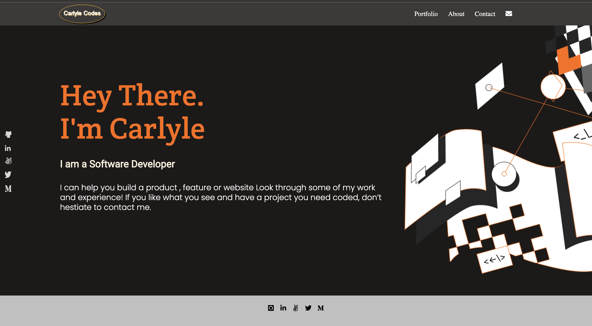

# MY PORTFOLIO: My responsive Personal Portfolio Site

> This project titled' **My Portfolio** is principally developed by me, *Chia Carlyle*, under the @Microverseinc curriculum. It is my portfolio site which contains information about the author and his resumè as a software developer. Click the link in the deployment to check it out. You can also view the [source code](https://github.com/carlylechia/MY-PORTFOLIO/). I am happy to welcome any comments, issues, contributions from everyone. Thank you for checking out `my portfolio`.

# Deployment
[click here](https://carlylechia.github.io/MY-PORTFOLIO/) to go to my portfolio site.

## Built With

- HTML and CSS
- Javascript
- Linters
- Figma

## Authors

👤 **Chia Carlyle**

- GitHub: [@carlylechia](https://github.com/carlylechia)
- Twitter: [@CarlyleChia](https://twitter.com/CarlyleChia)
- LinkedIn: [Chia Carlyle](https://linkedin.com/in/Chia-Carlyle)

## 🤝 Contributing

**ChristianIB**

Contributions, issues, and feature requests are welcome!

Feel free to check the [issues page](https://github.com/carlylechia/MY-PORTFOLIO/issues).

## Show your support

Give a ⭐️ if you like this project!

## Acknowledgments

- I am grateful to Microverse for guiding me along the this project from the very start.
- Big thank you to all my partners who have brainstormed with me and contributed in one way or another towards the realisation of this project.

## LICENSE

This project is MIT licensed.
[This](https://github.com/carlylechia/MY-PORTFOLIO/blob/main/LICENSE) is the link to the license.
